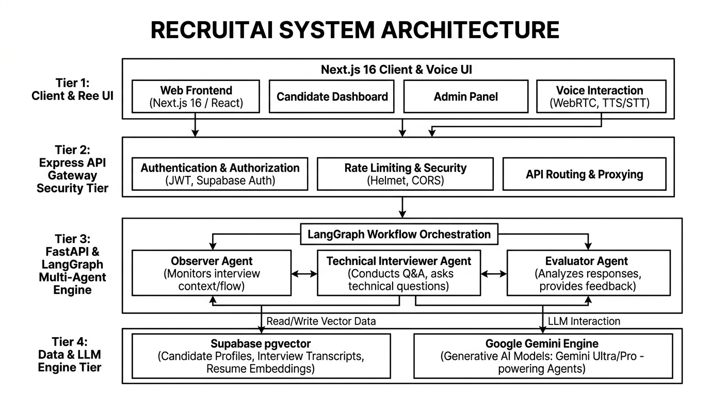

# 🚀 RecruitAI — Autonomous Multi-Agent AI Interview Partner

[](LICENSE)
[](https://nextjs.org/)
[](https://fastapi.tiangolo.com/)
[](https://www.langchain.com/langgraph)
[](https://supabase.com/)
[](https://expressjs.com/)

**RecruitAI** is a goal-driven, autonomous multi-agent AI technical interviewing platform built to simulate high-pressure, realistic coding and behavioral job interviews. 

Unlike simple single-prompt chat scripts, RecruitAI executes a **Graph-of-Graphs orchestration workflow** using **LangGraph**, combining real-time speech perception (*Observer Agent*), an 8-phase adaptive interview Finite State Machine (*Technical Interviewer Agent*), and automated rubric evaluation (*Evaluator Agent*).

---

## 🏛️ High-Level System Architecture (HLD)



```
====================================================================================================
                               RECRUITAI HIGH-LEVEL ARCHITECTURE (HLD)
====================================================================================================

 ┌────────────────────────────────────────────────────────────────────────────────────────────────┐
 │                                   NEXT.JS 16 FRONTEND TIER                                     │
 │  (App Router • TailwindCSS • Web Speech API • Speech Recognition & Synthesis • Clerk Auth)    │
 └───────────────────────────────────────────────┬────────────────────────────────────────────────┘
                                                 │ HTTPS / REST (Clerk Bearer JWT)
                                                 ▼
 ┌────────────────────────────────────────────────────────────────────────────────────────────────┐
 │                                 EXPRESS.JS API GATEWAY TIER                                    │
 │  (Port 3001 • Rate Limiting 100req/15m • Clerk authGuard • Axios Proxy • Payload Validation)   │
 └───────────────────────────────────────────────┬────────────────────────────────────────────────┘
                                                 │ Internal Proxy Route
                                                 ▼
 ┌────────────────────────────────────────────────────────────────────────────────────────────────┐
 │                              FASTAPI & LANGGRAPH AI BACKEND TIER                               │
 │  (Port 8000 • Master Orchestrator Graph • Resilient LLM Fallback • LangSmith Tracing)         │
 │                                                                                                │
 │   ┌──────────────────────┐    ┌──────────────────────────────────┐    ┌──────────────────────┐ │
 │   │    OBSERVER AGENT    │───►│   TECHNICAL INTERVIEWER AGENT    │───►│   EVALUATOR AGENT    │ │
 │   │ (Sentiment/Hesitation│    │   (8-Phase Adaptive FSM Protocol │    │  (Rubric Assessment  │ │
 │   │  Analysis & Hinting) │    │    + pgvector RAG Context)       │    │   0-100 Competency)  │ │
 │   └──────────────────────┘    └──────────────────────────────────┘    └──────────────────────┘ │
 └───────────────────────────────┬────────────────────────────────┬───────────────────────────────┘
                                 │                                │
                                 ▼                                ▼
 ┌──────────────────────────────────────────────┐ ┌──────────────────────────────────────────────┐
 │     SUPABASE POSTGRESQL + PGVECTOR STORE     │ │           GOOGLE GEMINI LLM ENGINE           │
 │  - `pgvector` Document Embeddings            │ │  - Primary: gemini-2.5-flash-lite            │
 │  - Session Transcripts & Evaluation Data     │ │  - Fallback: gemini-2.0-flash (Retry Backoff)│
 │  - Candidate Profile Persistence             │ │  - Embeddings: text-embedding-004            │
 └──────────────────────────────────────────────┘ └──────────────────────────────────────────────┘
====================================================================================================
```

---

## 🔄 Multi-Agent Sequence Flow

```
[Candidate Input]
        │
        ▼
┌──────────────────┐
│ Observer Agent   │ ──► Analyzes Sentiment & Silence Duration (silence_duration_ms)
└────────┬─────────┘
         │
         ▼
┌──────────────────┐
│ Interviewer Agent│ ──► Queries Supabase `pgvector` for resume chunks matching query (k=3)
└────────┬─────────┘
         │
         ├──► [Ongoing Turn] ──► Save Turn Transcript to Postgres & Return Spoken Response to UI
         │
         └──► [Closing Phase] ──► Trigger Evaluator Agent
                                         │
                                         ▼
                                 ┌──────────────────┐
                                 │ Evaluator Agent  │ ──► Compare Transcript vs Rubrics (rubric_seed.py)
                                 └────────┬─────────┘
                                          │
                                          ▼
                                 [Generate 0-100 Score Report & Save Evaluation]
```

---

## 📂 Detailed File-by-File Codebase Inventory

### 🤖 1. Backend Core (`backend/app/`)

#### Agents & LangGraph Subgraphs (`backend/app/agents/`)
- **[`orchestrator.py`](file:///c:/Users/moham/Downloads/RecruitAI/RecruitAI-main/backend/app/agents/orchestrator.py)**: The Master LangGraph StateGraph connecting `observer_node` -> `interviewer_node` -> `persist_turn_node` -> `evaluator_node`.
- **[`observer_graph.py`](file:///c:/Users/moham/Downloads/RecruitAI/RecruitAI-main/backend/app/agents/observer_graph.py)**: LangGraph subgraph agent analyzing candidate speech pauses (`silence_duration_ms`), sentiment, and setting `recommend_hint=True` when hesitant.
- **[`interviewer_graph.py`](file:///c:/Users/moham/Downloads/RecruitAI/RecruitAI-main/backend/app/agents/interviewer_graph.py)**: LangGraph subgraph agent executing the **8-Phase Interview Protocol** (*Introduction, Screening, Adaptation, Follow-Up, Deep Dive, Scenario, Feedback, Closing*) with pgvector context retrieval.
- **[`evaluator_graph.py`](file:///c:/Users/moham/Downloads/RecruitAI/RecruitAI-main/backend/app/agents/evaluator_graph.py)**: LangGraph subgraph agent comparing the complete transcript against stored role rubrics to compute 0–100 competency scores.
- **[`schemas.py`](file:///c:/Users/moham/Downloads/RecruitAI/RecruitAI-main/backend/app/agents/schemas.py)**: Pydantic schemas enforcing structured JSON output for all agents (`ObserverOutput`, `InterviewerAction`, `EvaluationResult`, `CandidateExtraction`).
- **[`state.py`](file:///c:/Users/moham/Downloads/RecruitAI/RecruitAI-main/backend/app/agents/state.py)**: Central `TurnState` TypedDict definition tracking session metadata, transcripts, and evaluation flags.

#### Backend Services (`backend/app/services/`)
- **[`database.py`](file:///c:/Users/moham/Downloads/RecruitAI/RecruitAI-main/backend/app/services/database.py)**: PostgreSQL / SQLAlchemy persistence layer exporting `save_turn`, `save_evaluation`, `get_analytics`, and `update_profile` with in-memory fallback.
- **[`extractor.py`](file:///c:/Users/moham/Downloads/RecruitAI/RecruitAI-main/backend/app/services/extractor.py)**: Candidate resume data extractor running `gemini-2.0-flash` to pull skills, gap analysis, and tailored strategy.
- **[`ingestion.py`](file:///c:/Users/moham/Downloads/RecruitAI/RecruitAI-main/backend/app/services/ingestion.py)**: Document loader and chunking service using `PyPDFLoader` and `RecursiveCharacterTextSplitter`.
- **[`llm_config.py`](file:///c:/Users/moham/Downloads/RecruitAI/RecruitAI-main/backend/app/services/llm_config.py)**: Configures resilient Gemini models (`gemini-2.5-flash-lite` primary with exponential backoff fallback to `gemini-2.0-flash`), `SQLiteCache`, and LangSmith tracing.
- **[`rag_engine.py`](file:///c:/Users/moham/Downloads/RecruitAI/RecruitAI-main/backend/app/services/rag_engine.py)**: Initializes Supabase `pgvector` store and provides metadata-filtered retrievers (`get_resume_retriever`, `get_rubric_retriever`).
- **[`rubric_seed.py`](file:///c:/Users/moham/Downloads/RecruitAI/RecruitAI-main/backend/app/services/rubric_seed.py)**: Pre-seeded standard evaluation rubrics for System Design, Backend, Frontend, and General Technical roles.

#### FastAPI Server & Tests
- **[`main.py`](file:///c:/Users/moham/Downloads/RecruitAI/RecruitAI-main/backend/app/main.py)**: FastAPI REST application exposing `/process-context`, `/orchestrator/turn`, `/feedback/evaluate`, `/analytics/history`, and `/profile/{user_id}`.
- **[`tests/`](file:///c:/Users/moham/Downloads/RecruitAI/RecruitAI-main/backend/tests/)**: Pytest suite containing `test_database.py`, `test_ingestion.py`, and `test_orchestrator.py` (10/10 tests passing).

---

### 🛡️ 2. Express API Gateway (`gateway/`)

- **[`server.js`](file:///c:/Users/moham/Downloads/RecruitAI/RecruitAI-main/gateway/src/server.js)**: Gateway entry point configuring Express, Helmet security headers, CORS, and route mounting.
- **[`routes/interview.routes.js`](file:///c:/Users/moham/Downloads/RecruitAI/RecruitAI-main/gateway/src/routes/interview.routes.js)**: Express route handlers for public endpoints (`/health`, `/process-context`, `/interview/chat/next-turn`, `/interview/generate-feedback`, `/interview/dashboard/:userId`, `/interview/profile/:userId`).
- **[`middleware/auth.middleware.js`](file:///c:/Users/moham/Downloads/RecruitAI/RecruitAI-main/gateway/src/middleware/auth.middleware.js)**: Clerk Bearer JWT token verification guard.
- **[`middleware/rateLimit.middleware.js`](file:///c:/Users/moham/Downloads/RecruitAI/RecruitAI-main/gateway/src/middleware/rateLimit.middleware.js)**: Sliding-window rate limiter enforcing max 100 requests per 15 minutes per IP.
- **[`middleware/validate.middleware.js`](file:///c:/Users/moham/Downloads/RecruitAI/RecruitAI-main/gateway/src/middleware/validate.middleware.js)**: Request payload validation helpers.
- **[`services/fastapiClient.js`](file:///c:/Users/moham/Downloads/RecruitAI/RecruitAI-main/gateway/src/services/fastapiClient.js)**: Axios HTTP client proxying requests from gateway to FastAPI backend.
- **[`tests/interview.routes.test.js`](file:///c:/Users/moham/Downloads/RecruitAI/RecruitAI-main/gateway/tests/interview.routes.test.js)**: Jest & Supertest integration suite (9/9 tests passing).

---

### 💻 3. Next.js 16 Frontend (`frontend/`)

- **[`app/page.tsx`](file:///c:/Users/moham/Downloads/RecruitAI/RecruitAI-main/frontend/app/page.tsx)**: Landing & setup page for uploading PDF resumes, setting job descriptions, and selecting voice/chat modes.
- **[`app/interview/page.tsx`](file:///c:/Users/moham/Downloads/RecruitAI/RecruitAI-main/frontend/app/interview/page.tsx)**: Live interview interface featuring Web Speech API voice synthesis, live transcript, and phase progression indicator.
- **[`app/feedback/page.tsx`](file:///c:/Users/moham/Downloads/RecruitAI/RecruitAI-main/frontend/app/feedback/page.tsx)**: Post-interview feedback dashboard displaying overall scores (/100), competency bar charts, key strengths, and growth recommendations.
- **[`app/dashboard/page.tsx`](file:///c:/Users/moham/Downloads/RecruitAI/RecruitAI-main/frontend/app/dashboard/page.tsx)**: Historical candidate dashboard displaying past interview sessions, score trends, and detailed turn modals.
- **[`app/profile/page.tsx`](file:///c:/Users/moham/Downloads/RecruitAI/RecruitAI-main/frontend/app/profile/page.tsx)**: Profile management page for configuring target role and primary tech stack preferences.
- **[`app/not-found.tsx`](file:///c:/Users/moham/Downloads/RecruitAI/RecruitAI-main/frontend/app/not-found.tsx)**: Branded 404 error page.
- **[`app/error.tsx`](file:///c:/Users/moham/Downloads/RecruitAI/RecruitAI-main/frontend/app/error.tsx)**: Global error boundary with retry triggers.
- **[`app/loading.tsx`](file:///c:/Users/moham/Downloads/RecruitAI/RecruitAI-main/frontend/app/loading.tsx)**: Skeleton loader component.
- **[`components/Navbar.tsx`](file:///c:/Users/moham/Downloads/RecruitAI/RecruitAI-main/frontend/components/Navbar.tsx)**: Sticky header with logo, navigation links (Practice, Dashboard, Profile), and Clerk UserButton.

---

## 🛠️ Feature & Technology Inventory

| Tier | Component | Technology | Purpose |
|---|---|---|---|
| **Frontend** | Framework | Next.js 16 (App Router) | Client application with server-side rendering & static prerendering |
| | Styling | Tailwind CSS v4, Lucide Icons | Modern dark-mode glassmorphism design system |
| | Auth | Clerk Auth | JWT session validation & user identity |
| | Voice | Web Speech API | Native client-side Speech Recognition & Speech Synthesis |
| **Gateway** | API Gateway | Node.js, Express.js | Security proxy, CORS handling, and rate limiting |
| | Middleware | `express-rate-limit`, `helmet`, `jsonwebtoken` | Defense-in-depth security guard |
| **Backend** | Agent Engine | Python 3.11+, FastAPI, LangGraph | Stateful multi-agent state machine orchestrator |
| | LLM Engine | Gemini 2.5 Flash Lite & 2.0 Flash | Ultra-low latency structured JSON output |
| | Vector DB | Supabase PostgreSQL + `pgvector` | RAG vector embeddings using `text-embedding-004` |
| | Cache & Retry | LangChain `SQLiteCache`, exponential backoff | Zero-cost response caching & API resilience |

---

## 🚀 Quick Start (Local Setup)

### Option A: Using Docker Compose (Simplest)
```bash
# 1. Clone repository
git clone https://github.com/mohammadhafeezuddin81/RecruitAI.git
cd RecruitAI

# 2. Create environment file
cp .env.example .env

# 3. Launch stack
docker compose up --build
```

Access endpoints:
- **Frontend**: `http://localhost:3000`
- **Express Gateway**: `http://localhost:3001`
- **FastAPI Backend**: `http://localhost:8000`

---

### Option B: Manual Setup

#### 1. FastAPI Backend (Port 8000)
```bash
cd backend
python -m venv venv
# Windows:
.\venv\Scripts\activate
# Linux/macOS:
source venv/bin/activate

pip install -r requirements.txt
python -m uvicorn app.main:app --reload --port 8000
```

#### 2. Express Gateway (Port 3001)
```bash
cd gateway
npm install
npm run dev
```

#### 3. Next.js Frontend (Port 3000)
```bash
cd frontend
npm install
npm run dev
```

---

## 🧪 Automated Testing Commands

### Gateway Integration Tests (Jest & Supertest)
```bash
cd gateway
npm test
```
*Result: 9 / 9 passed (100% pass rate)*

### Backend Unit & Graph Tests (Pytest)
```bash
cd backend
python -m pytest -v
```
*Result: 10 / 10 passed (100% pass rate)*

---

## 📄 Extended Documentation

- 🏛️ [3D Architecture Deep Dive](docs/ARCHITECTURE.md) — Comprehensive guide on state machine routing and RAG pipelines.
- 📡 [REST API Specification](docs/API.md) — Detailed reference of all Gateway and FastAPI REST endpoints.
- ☁️ [Production Deployment Guide](docs/DEPLOYMENT.md) — Step-by-step guide for Vercel, Render, and Supabase deployment.

---

## 📜 License

Distributed under the MIT License. See `LICENSE` for details.
