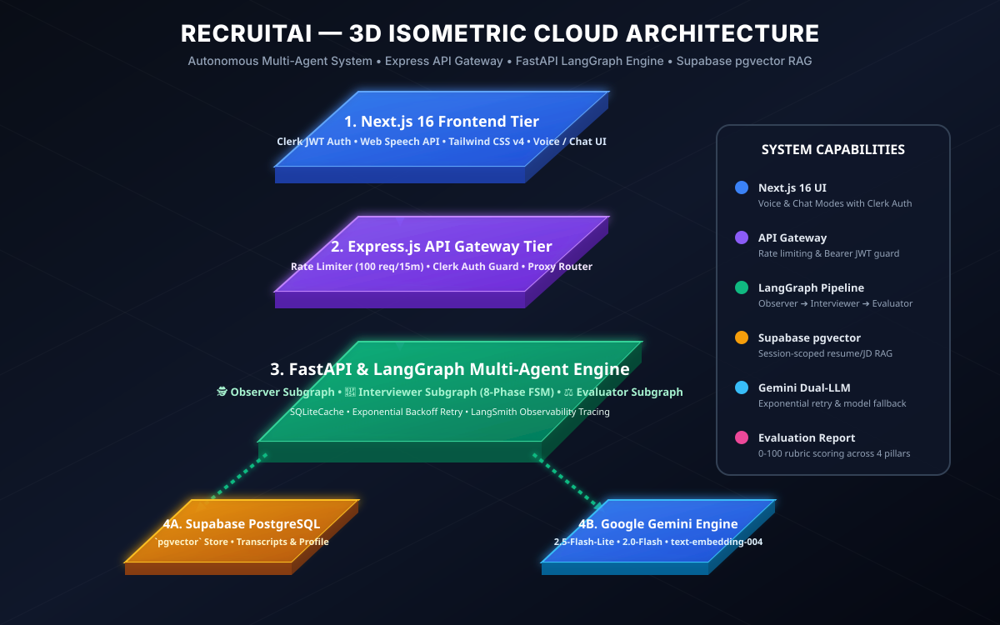

# 🚀 **RecruitAI — The Multi-Agent AI Interview Partner**

**Status:** Production Ready  
**Architecture:** Multi-Agent LangGraph System + Express API Gateway + RAG Ingestion + Cloud Run

---

## 1️⃣ **Executive Summary**

**RecruitAI** is a **multi-agent, adaptive AI platform** designed to simulate realistic, high-pressure technical and behavioral job interviews.

Unlike simple single-prompt chatbots, RecruitAI operates as a **Goal-Driven Multi-Agent System** with an **8-phase Finite State Machine (FSM)**, session-scoped **RAG (Retrieval-Augmented Generation)**, LLM response caching, and automated post-session evaluation against scoring rubrics.

---

## 2️⃣ **System Architecture**



```
┌──────────────────┐
│ Next.js Frontend  │  (Clerk auth, Vapi voice UI)
└─────────┬──────────┘
          │ HTTPS (Clerk JWT)
          ▼
┌──────────────────────────┐
│ Node/Express Gateway       │  Cloud Run (public)
│ auth · validation · rate   │
│ limit · routes to backend  │
└─────────┬──────────────────┘
          │ internal (IAM-authed)
          ▼
┌────────────────────────────────────────────────────────┐
│ Python FastAPI — Agent Service        Cloud Run (internal)│
│                                                            │
│   ┌────────────────────────────────────────────────┐     │
│   │           Orchestrator Graph (LangGraph)         │     │
│   │                                                    │     │
│   │  ┌───────────┐  ┌───────────────┐  ┌───────────┐│     │
│   │  │ Observer   │→│ Interviewer     │→│ (on close) ││     │
│   │  │ subgraph   │  │ subgraph        │  │ Evaluator ││     │
│   │  └───────────┘  └───────────────┘  │ subgraph   ││     │
│   │                                       └───────────┘│     │
│   └────────────────────────────────────────────────┘     │
│                                                            │
│   Ingestion Pipeline (LangChain loaders + splitters)      │
│   → Chroma vector store (RAG for resume/JD/rubric)        │
│   Observability: LangSmith tracing                         │
│   Reliability: retry + fallback wrappers, LLM cache        │
└─────────┬──────────────────────────────────────────────┘
          │
          ▼
┌──────────────────┐
│ Firebase Firestore │  session state, transcripts, evaluations
└──────────────────┘
```

---

## 3️⃣ **Multi-Agent Capabilities (🧠 The Brain)**

RecruitAI uses **LangGraph Graph-of-Graphs** orchestration across three specialized subgraphs:

### 🕵️ **1. Observer Agent Subgraph**
- Performs real-time sentiment analysis on candidate turns.
- Analyzes voice pauses (>2s) and speech hesitation markers.
- Flags `recommend_hint` when a candidate gets stuck on technical concepts.

### 👔 **2. Interviewer Agent Subgraph (8-Phase Adaptive FSM)**
- Progresses candidates through a structured interview lifecycle:

| Phase | Description |
|---|---|
| 🗣️ **1. Introduction** | Welcoming, build rapport, and verify background |
| 🧐 **2. Screening** | Verify foundational fit against Job Description core skills |
| 🛠️ **3. Adaptation** | Adjust difficulty; provide hints if candidate struggles |
| 📝 **4. Follow-Up** | Dynamic probing into specific technical mechanisms |
| 🔍 **5. Deep Dive** | Drill into uploaded Resume projects and architecture decisions |
| 🎭 **6. Scenario** | Real-world situational judgment and trade-off troubleshooting |
| 💬 **7. Feedback** | Interim encouraging validation |
| 🎯 **8. Closing** | Professional session conclusion and transition to evaluation |

### ⚖️ **3. Evaluator Agent Subgraph**
- Retrieves role-specific scoring rubrics from ChromaDB.
- Generates multidimensional scores (Technical, Communication, Problem Solving).
- Features a **confidence-gated retry loop** (re-evaluates if confidence < 0.70).

---

## 4️⃣ **Tech Stack & Feature Inventory**

| Component | Technology | Purpose |
|---|---|---|
| **Frontend** | Next.js 14, Tailwind CSS | Reactive UI, WebRTC voice interface, camera |
| **Auth** | Clerk | Candidate identity and JWT session validation |
| **API Gateway** | Node.js, Express | Public entrypoint: rate limiting, validation, auth guard |
| **Agent Service** | Python 3.11, FastAPI | High-performance async microservice running agent graphs |
| **Agent Orchestration** | LangGraph (StateGraph) | Explicit multi-agent control flow and conditional routing |
| **RAG & Ingestion** | LangChain (`PyPDFLoader`, `RecursiveCharacterTextSplitter`) + ChromaDB | Session/role-scoped document chunking and retrieval |
| **LLM** | Google Gemini 2.5 Flash Lite (+ 2.0 Flash fallback) | Sub-800ms low-latency structured reasoning |
| **Reliability** | LangChain `.with_retry().with_fallbacks()` + `SQLiteCache` | Resilient model calls and instant cache hits on greetings |
| **Observability** | LangSmith Tracing | Visual execution trace of all agent nodes and decisions |
| **Voice** | Vapi.ai, Deepgram, 11Labs | Speech-to-text, low-latency TTS, barge-in interruption |
| **Database** | Firebase Firestore | Session state, turn transcripts, and evaluation storage |
| **Deployment** | Google Cloud Run, Firebase Hosting | Containerized serverless microservices |
| **CI/CD** | GitHub Actions | Automated Jest and Pytest test runners |

---

## 5️⃣ **Project Folder Structure**

```
recruitai/
├── gateway/                          # Node/Express API Gateway
│   ├── src/
│   │   ├── server.js
│   │   ├── routes/{interview,health}.routes.js
│   │   ├── middleware/{auth,validate,rateLimit}.middleware.js
│   │   └── services/fastapiClient.js
│   ├── tests/interview.routes.test.js
│   ├── Dockerfile
│   └── package.json
│
├── backend/
│   ├── app/
│   │   ├── agents/
│   │   │   ├── schemas.py            # Pydantic structured-output models
│   │   │   ├── state.py              # LangGraph state TypedDicts
│   │   │   ├── observer_graph.py
│   │   │   ├── interviewer_graph.py
│   │   │   ├── evaluator_graph.py
│   │   │   └── orchestrator.py       # composes all three subgraphs
│   │   ├── services/
│   │   │   ├── rag_engine.py         # Chroma retrievers
│   │   │   ├── ingestion.py          # document loaders + splitters
│   │   │   ├── database.py           # Firestore persistence layer
│   │   │   ├── llm_config.py         # caching, retry, fallback, tracing setup
│   │   │   ├── gemini.py
│   │   │   └── extractor.py
│   │   └── main.py
│   ├── tests/
│   │   ├── test_orchestrator.py
│   │   ├── test_ingestion.py
│   │   └── test_database.py
│   ├── Dockerfile
│   └── requirements.txt
│
├── frontend/                         # Next.js 14
│   ├── app/
│   ├── components/
│   └── package.json
│
├── docs/
│   ├── API.md
│   └── architecture-diagram.svg
│
├── .github/workflows/ci.yml
├── .gitignore
└── README.md
```

---

## 6️⃣ **Getting Started**

### Prerequisites
- Node.js 20+
- Python 3.11+
- Google Gemini API Key
- Firebase Project credentials (`serviceAccountKey.json`)
- Clerk API Keys (for frontend)

---

### Step 1: Run Backend Agent Service
```bash
cd backend
python -m venv venv
# Windows:
.\venv\Scripts\activate
# Linux/macOS:
source venv/bin/activate

pip install -r requirements.txt

# Run server
uvicorn app.main:app --reload --port 8000
```

### Step 2: Run Express API Gateway
```bash
cd gateway
npm install
npm run dev
```

### Step 3: Run Frontend
```bash
cd frontend
npm install
npm run dev
```

---

## 7️⃣ **Testing**

### Run Gateway Tests (Jest & Supertest)
```bash
cd gateway
npm test
```

### Run Backend Tests (Pytest)
```bash
cd backend
pytest -v
```

---

## 8️⃣ **Core System Capabilities**

- **Multi-Agent Orchestration**: Three dedicated LangGraph subgraphs (Observer, Interviewer, Evaluator) supervised under an Orchestrator graph driving an 8-phase adaptive interview FSM.
- **Session-Scoped RAG Pipeline**: LangChain loaders and splitters indexing documents into a metadata-filtered ChromaDB vector store.
- **Enterprise Reliability & Observability**: Automated LLM retry/fallback wrappers, SQLite response caching, and LangSmith tracing.
- **Secure Dual-Service Architecture**: Node/Express public API gateway (Clerk auth, rate limiting) fronting an internal FastAPI agent microservice with IAM service authentication.
- **Automated CI/CD**: GitHub Actions pipeline executing full Jest and Pytest test suites on every push.
