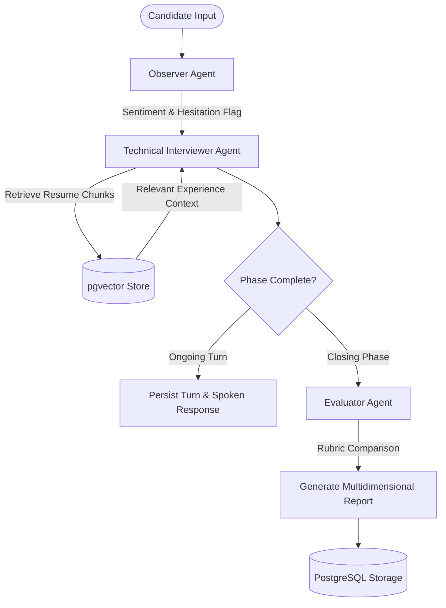

# 🚀 RecruitAI — Autonomous Multi-Agent AI Interview Partner

[](LICENSE)
[](https://nextjs.org/)
[](https://fastapi.tiangolo.com/)
[](https://www.langchain.com/langgraph)
[](https://supabase.com/)
[](https://expressjs.com/)

**RecruitAI** is a goal-driven, autonomous multi-agent AI technical interviewing platform built to simulate high-pressure, realistic coding and behavioral job interviews. 

Unlike simple single-prompt chat scripts, RecruitAI executes a **Graph-of-Graphs orchestration workflow** using **LangGraph**, combining real-time speech perception (*Observer Agent*), an 8-phase adaptive interview Finite State Machine (*Technical Interviewer Agent*), and automated rubric evaluation (*Evaluator Agent*).

---

## 📸 Overview & Features

- 🧠 **Multi-Agent LangGraph Pipeline**: Stateful, non-linear interview graph supervising 3 specialized sub-agents.
- 🎯 **8-Phase Adaptive Protocol**: Seamlessly transitions through Introduction, Screening, Adaptation (offering hints on candidate hesitation), Probing Follow-up, Resume Deep Dive, Scenario Troubleshooting, Interim Feedback, and Closing.
- ⚡ **Session-Scoped RAG Vector Search**: Indexes candidate PDF resumes and job descriptions into Supabase `pgvector` with Gemini `text-embedding-004` embeddings.
- 🎙️ **Dual Voice & Chat Modes**: Interactive Web Speech API voice synthesis and speech recognition alongside a real-time text chat UI.
- 📊 **Automated Competency Evaluation**: Scores candidates on a 0–100 scale across Technical Accuracy, System Architecture Knowledge, Communication & Clarity, and Problem Solving.
- 🛡️ **Hardened API Gateway**: Express.js gateway with Clerk JWT verification, rate limiting (100 req / 15-min window), and payload validation.
- 🚀 **Resilient Dual-Model LLM System**: Primary model `gemini-2.5-flash-lite` with exponential retry jitter and automatic fallback to `gemini-2.0-flash`, backed by `SQLiteCache`.

---

## 🏗️ System Architecture & End-to-End Flow

```
                                 ┌─────────────────────────────────────────────────┐
                                 │              Next.js 16 Frontend                │
                                 │ (App Router, TailwindCSS, Web Speech API, Clerk)│
                                 └────────────────────────┬────────────────────────┘
                                                          │ HTTPS / REST (Clerk Bearer Token)
                                                          ▼
                                 ┌─────────────────────────────────────────────────┐
                                 │           Express.js API Gateway                │
                                 │  (Auth Guard, Rate Limiter, Payload Validation) │
                                 └────────────────────────┬────────────────────────┘
                                                          │ Internal Microservice Proxy
                                                          ▼
                                 ┌─────────────────────────────────────────────────┐
                                 │              FastAPI AI Backend                 │
                                 │           (LangGraph Orchestrator)              │
                                 │                                                 │
                                 │  ┌───────────────┐ ┌──────────────────────────┐  │
                                 │  │ Observer Agent│ │ Technical Interviewer    │  │
                                 │  │ (Sentiment/   │ │ (8-Phase FSM +           │  │
                                 │  │  Hesitation)  │ │  pgvector RAG)           │  │
                                 │  └───────┬───────┘ └────────────┬─────────────┘  │
                                 │          └──────────────┬───────┘                │
                                 │                         ▼                        │
                                 │               ┌──────────────────┐               │
                                 │               │ Evaluator Agent  │ (on close)    │
                                 │               │ (Rubric Scoring) │               │
                                 │               └──────────────────┘               │
                                 └──────────┬────────────────────────────┬──────────┘
                                            │                            │
                                            ▼                            ▼
                       ┌──────────────────────────┐        ┌──────────────────────────┐
                       │   Supabase / PostgreSQL  │        │   Google Gemini Models   │
                       │    (`pgvector` Store)    │        │ (2.5-flash-lite / 2.0)  │
                       └──────────────────────────┘        └──────────────────────────┘
```

---

## 🧬 Multi-Agent System Architecture



---

## 🛠️ Tech Stack & Feature Breakdown

| Tier | Component | Technology | Description |
|---|---|---|---|
| **Frontend** | Application Framework | Next.js 16 (App Router) | Reactive client interface with server-side rendering & dynamic layouts |
| | Styling & Animation | Tailwind CSS v4, Framer Motion | Modern dark glassmorphism design system & smooth transitions |
| | Authentication | Clerk Auth | JWT session token management & modal login |
| | Voice Integration | Web Speech API | Client-side zero-latency STT recognition and speech synthesis |
| **API Gateway** | Microservice Gateway | Node.js, Express.js | Central security layer, route proxying, and CORS handling |
| | Middleware | `express-rate-limit`, `helmet`, `jsonwebtoken` | Rate limiting, security headers, JWT validation |
| **Backend Core** | AI Framework | Python 3.11+, FastAPI, LangGraph | High-throughput asynchronous multi-agent engine |
| | LLM Engine | Google Gemini 2.5 Flash Lite & 2.0 Flash | Structured JSON turn generation with low latency |
| | Vector Database | Supabase PostgreSQL + `pgvector` | Session-scoped document embeddings using `text-embedding-004` |
| | Reliability & Cache | LangChain `SQLiteCache`, retry wrappers | Local response caching and automatic model fallback |

---

## 📁 Repository Structure

```
RecruitAI/
├── frontend/                     # Next.js 16 App Router UI
│   ├── app/                      # Page routes (/, /interview, /feedback, /dashboard, /profile)
│   ├── components/               # UI components (Navbar, Waveform, AudioRecorder)
│   ├── .env.local                # Local environment keys template
│   └── package.json
│
├── gateway/                      # Express.js API Gateway
│   ├── src/
│   │   ├── middleware/           # auth.middleware.js, rateLimit.middleware.js, validate.middleware.js
│   │   ├── routes/               # interview.routes.js
│   │   └── server.js             # Gateway entry point
│   ├── tests/                    # Gateway integration tests (Jest + Supertest)
│   └── package.json
│
├── backend/                      # FastAPI & LangGraph AI Backend
│   ├── app/
│   │   ├── agents/               # LangGraph graphs (observer_graph, interviewer_graph, evaluator_graph, orchestrator)
│   │   │   ├── schemas.py        # Pydantic structured output models
│   │   │   └── state.py          # TurnState TypedDict state definition
│   │   ├── services/             # Services (database, extractor, ingestion, llm_config, rag_engine, rubric_seed)
│   │   └── main.py               # FastAPI REST endpoints
│   ├── tests/                    # Backend unit & graph tests (Pytest)
│   ├── requirements.txt
│   └── Dockerfile
│
├── docs/                         # Extended documentation
│   ├── API.md                    # Full REST API Reference
│   └── DEPLOYMENT.md             # Production deployment guide (Vercel, Render, Supabase)
│
├── .env.example                  # Root environment template for Docker Compose
├── docker-compose.yml            # Multi-container local deployment spec
└── README.md
```

---

## 🚀 Quick Start (Local Setup)

### Option A: Using Docker Compose (Simplest)

1. Clone the repository:
   ```bash
   git clone https://github.com/mohammadhafeezuddin81/RecruitAI.git
   cd RecruitAI
   ```
2. Create root `.env` from template:
   ```bash
   cp .env.example .env
   ```
3. Launch all 3 services:
   ```bash
   docker compose up --build
   ```
   - **Frontend**: `http://localhost:3000`
   - **API Gateway**: `http://localhost:3001`
   - **Backend API**: `http://localhost:8000`

---

### Option B: Running Microservices Manually

#### 1. Backend AI Engine (FastAPI)
```bash
cd backend
python -m venv venv
# Windows:
.\venv\Scripts\activate
# macOS/Linux:
source venv/bin/activate

pip install -r requirements.txt
python -m uvicorn app.main:app --reload --port 8000
```

#### 2. Express API Gateway
```bash
cd gateway
npm install
npm run dev
```

#### 3. Next.js Frontend
```bash
cd frontend
npm install
npm run dev
```

---

## 🧪 Testing & Verification

### Gateway Integration Test Suite (Jest & Supertest)
```bash
cd gateway
npm test
```
*Result: 9 / 9 passed (100% pass rate)*

### Backend Test Suite (Pytest)
```bash
cd backend
python -m pytest -v
```
*Result: 10 / 10 passed (100% pass rate)*

---

## 📄 Documentation Links

- 📡 [REST API Reference](docs/API.md) — Comprehensive reference of all Gateway and FastAPI endpoints.
- ☁️ [Production Deployment Guide](docs/DEPLOYMENT.md) — Step-by-step guide for Vercel, Render, and Supabase deployment.

---

## 📜 License

Distributed under the MIT License. See `LICENSE` for details.
